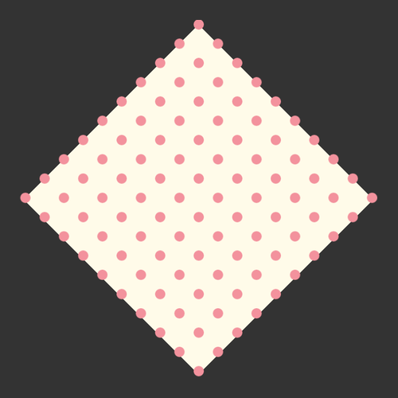
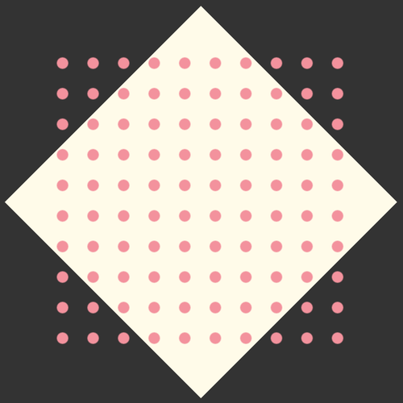

# physics-dots

A physics simulation made with phaserJS. Dots fall with gravity when clicked. Try the [live demo](https://strawstack.github.com/InteractiveArt/physics-dots)

# screenshot

# notes

In order to place the dots in a diamond shaped grid pattern. The dots were frist placed in a rectangular grid pattern and then rotated 45 degrees clockwise. The images below show the state of the dots before and after the rotation. Placing the dots this way was much easier than calculating the correct spacing for the diamond for each dot individually.

